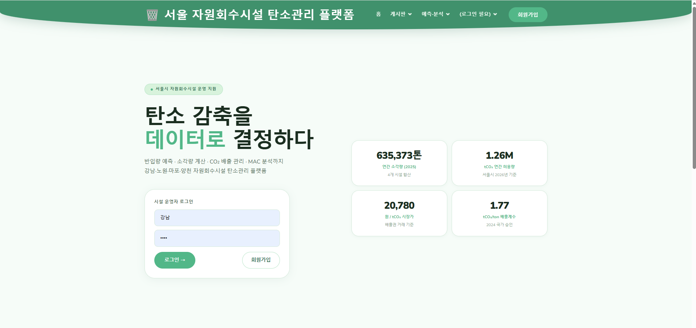
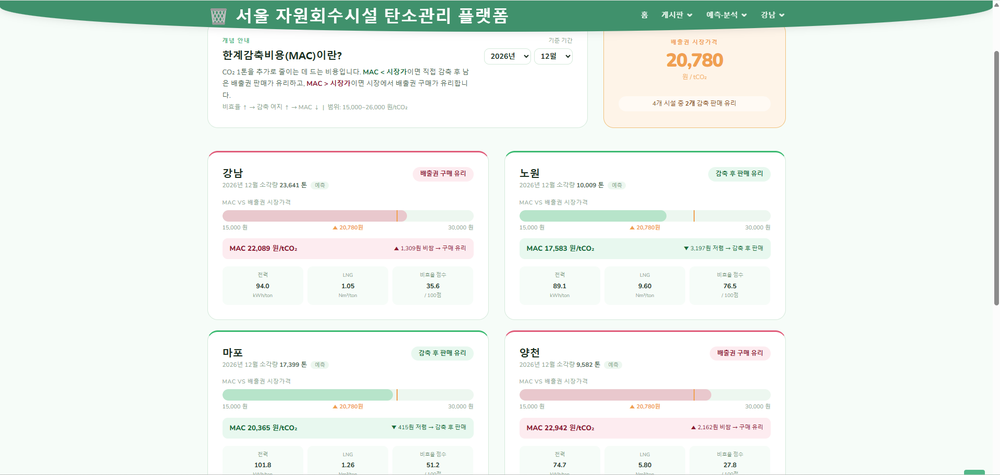
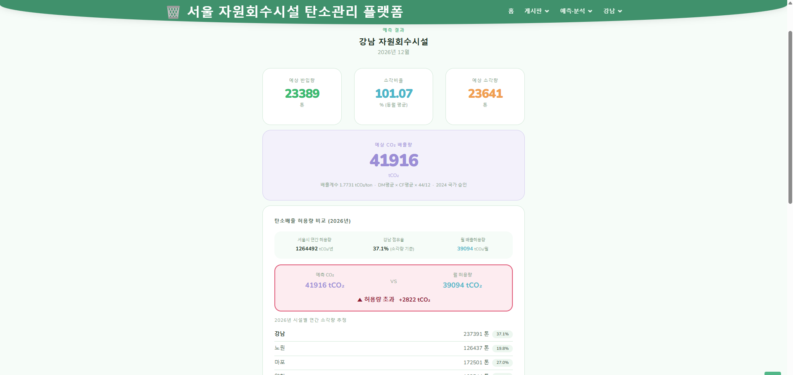

# 서울 자원회수시설 탄소관리 플랫폼

서울시 강남·노원·마포·양천 자원회수시설의 쓰레기 반입량·소각량을 예측하고, CO₂ 배출량 산정 및 한계감축비용(MAC) 분석까지 지원하는 웹 기반 탄소관리 플랫폼입니다.

---

## 화면 구성

**① 메인 화면** — 로그인 후 주요 지표 및 기능 바로가기 제공



**② 반입량·소각량 예측** — 시설·연도·월 선택 후 XGBoost 모델로 반입량, 소각량, CO₂ 배출량 자동 산정



**③ 의사결정 지원** — 탄소 허용량 초과 여부 및 한계감축비용(MAC) 기반 배출권 구매 vs 직접 감축 판단



---

## 주요 기능

| 기능 | 설명 |
|---|---|
| 반입량 예측 | XGBoost 모델로 선택 시설·연월의 반입량(ton) 예측 (2015~2035) |
| 소각량 산정 | 과거 동월 소각비율 실데이터 평균으로 소각량 자동 계산 |
| CO₂ 배출량 산정 | 2024년 국가 승인 배출계수(DM × CF × 44/12) 적용 |
| 월 허용량 배분 | 서울시 연간 탄소 허용량을 시설 소각 비율로 월 단위 배분 |
| MAC 분석 | 전력·LNG 효율 기반 한계감축비용 산출 → 배출권 구매 vs 직접 감축 판단 |
| 게시판 | 공지사항 / 커뮤니티 / Q&A (관리자·회원 권한 분리) |
| 회원 관리 | 시설별 운영자 계정 관리 (관리자 / 일반회원) |

---

## 기술 스택

- **Backend**: Python 3.7, Django 3.2
- **Database**: MariaDB
- **ML**: XGBoost 1.6, scikit-learn 1.0, pandas, numpy, joblib
- **Frontend**: Bootstrap 5, Boxicons, AOS

---

## 프로젝트 구조

```
waste-incineration-forecast/
├── config/                       # Django 설정 (settings, urls, views)
├── board/                        # 게시판 앱 (공지·커뮤니티·Q&A)
├── member/                       # 회원 앱 (로그인·권한·시설 배정)
├── ml_models/                    # 학습된 XGBoost 모델
├── data/
│   ├── raw/                      # 원본 수집 데이터
│   ├── processed/                # 전처리 완료 데이터
│   ├── features/                 # 모델 학습 직전 데이터
│   └── results/                  # 분석 결과 파일
├── templates/                    # HTML 템플릿
├── static/                       # CSS, JS, 이미지
├── train_incoming_model.py       # 반입량 예측 모델 학습 스크립트
├── train_incineration_model.py   # 소각비율 예측 모델 학습 스크립트
├── manage.py
└── requirements.txt
```

---

## 설치 및 실행

**1. 패키지 설치**

```bash
pip install -r requirements.txt
```

**2. MariaDB 데이터베이스 생성**

```sql
CREATE DATABASE trashdb CHARACTER SET utf8mb4 COLLATE utf8mb4_unicode_ci;
```

**3. DB 설정 변경** (`config/settings.py`)

```python
DATABASES = {
    'default': {
        'ENGINE': 'django.db.backends.mysql',
        'NAME': 'trashdb',
        'USER': 'root',
        'PASSWORD': '비밀번호',
        'HOST': 'localhost',
        'PORT': '3306',
    }
}
```

**4. 마이그레이션 및 서버 실행**

```bash
python manage.py migrate
python manage.py runserver
```

**5. ML 모델 재학습 (선택)**

```bash
python train_incoming_model.py
python train_incineration_model.py
```

---

## 머신러닝 모델

**반입량 예측 모델** (`incoming_xgb_model.pkl`)
- 알고리즘: XGBoost Regressor
- 입력 피처: 전월 반입량 / 전전월 평균 / 3개월 평균 / 전년 동월 반입량
- 실데이터 없는 미래 월은 재귀적으로 예측

**소각비율 예측 모델** (`incineration_xgb_model.pkl`)
- 알고리즘: XGBoost Regressor
- 입력 피처: 과거 동월 평균 소각비율
- 출력: 소각비율 (소각량 / 반입량)

---

## 배출계수 기준

- 출처: 2024년 승인 국가 온실가스 배출·흡수계수
- 적용 품목: 종이류, 고무류, 피혁류, 플라스틱류, 섬유류, 기타
- 계산식: DM 평균 × CF 평균 × (44/12) ≈ 1.77 tCO₂/ton

---

## 대상 시설

강남 / 노원 / 마포 / 양천 자원회수시설 (서울시)

---

## 개발자

BBUHO-basket · Industrial Engineering  
Python | Django | Machine Learning | Data Analysis
